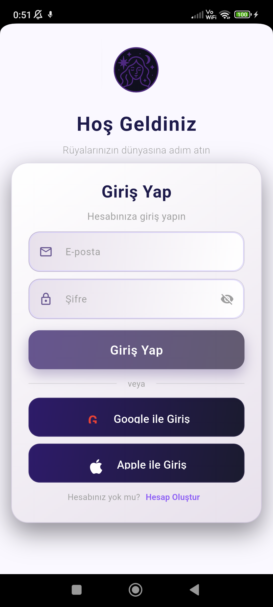
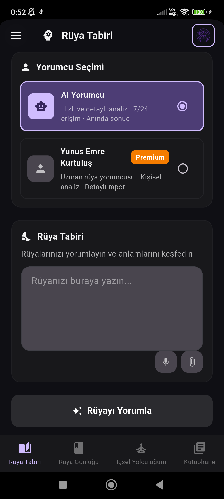
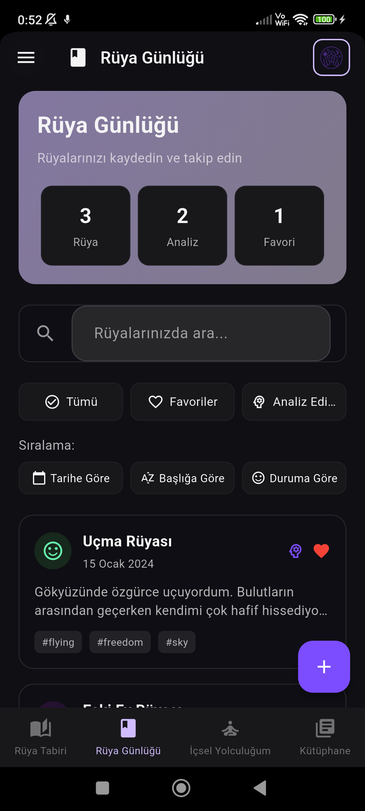
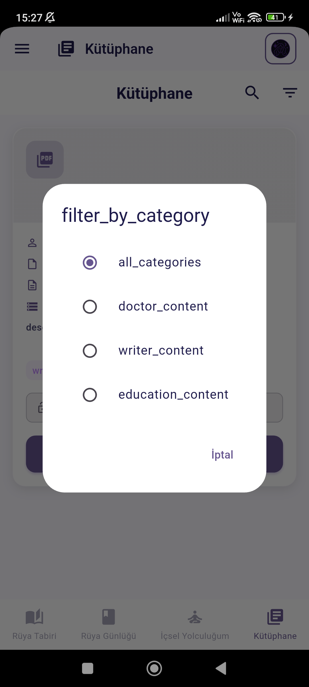
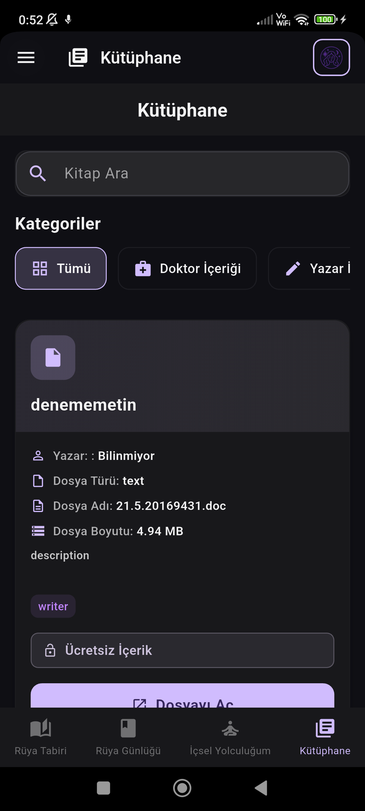
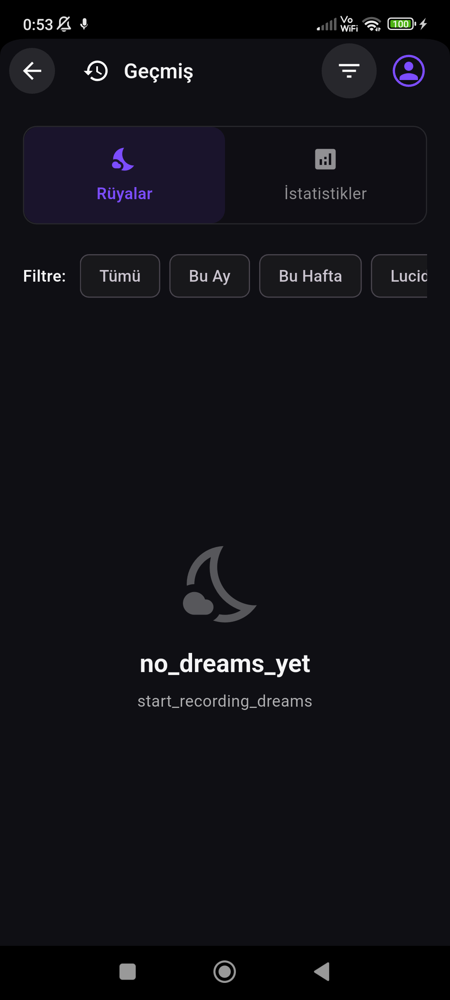
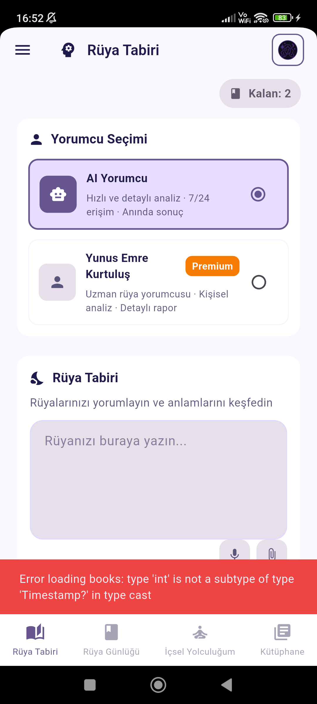
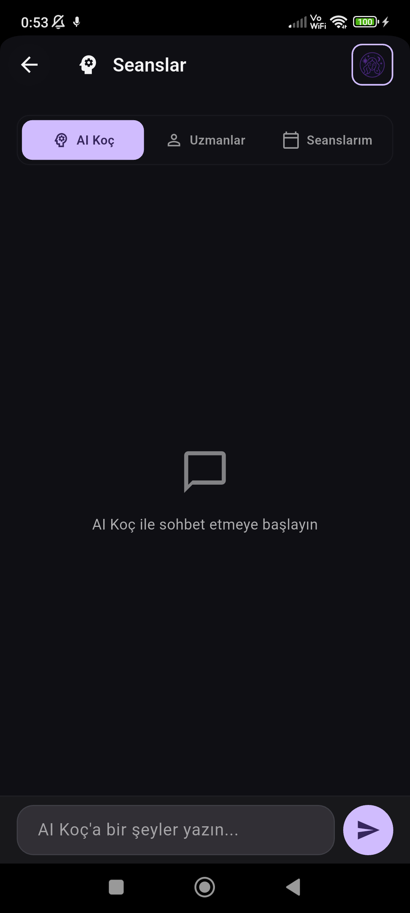

# 🌙 InnerDreams - Rüya Tabirleri ve AI Koçluk Uygulaması

[](https://flutter.dev)
[](https://firebase.google.com)
[]()
[](LICENSE)

> **Profesyonel, ticari bir mobil uygulama** - Kullanıcıların rüyalarını analiz etmelerine, kişisel gelişim eğitimleri almalarına ve uzmanlarla bağlantı kurmalarına olanak tanıyan full-stack platform.

---

## ⚠️ ÖNEMLİ NOTLAR

> **🔒 Bu proje ticari bir üründür ve tüm hakları saklıdır.**
>
> - Bu repository **yalnızca portföy ve vitrin amaçlıdır**
> - Kaynak kod **görüntüleme amacıyla** paylaşılmaktadır
> - **Hiçbir kullanım, kopyalama veya dağıtım hakkı verilmemektedir**
> - Backend kodları ve hassas bilgiler **güvenlik nedeniyle kaldırılmıştır**
> - Proje aktif olarak geliştirilmekte ve kullanılmaktadır
>
> Lisans bilgileri için [LICENSE](LICENSE) dosyasına bakınız.

---

## 📱 Uygulama Önizlemesi

<p align="center">
  
  
  
  
</p>

<p align="center">
  
  
  
  
</p>

---

## 🎯 Proje Hakkında

**InnerDreams**, modern mobil uygulama geliştirme teknolojilerini kullanarak oluşturulmuş, production-ready ticari bir platformdur:

### Teknik Altyapı

- **📱 Flutter Mobil Uygulama**: iOS ve Android için native performanslı cross-platform uygulama
- **☁️ Firebase Backend**: Scalable cloud infrastructure (Authentication, Firestore, Storage, Cloud Functions)
- **⚙️ RESTful API**: Custom Node.js backend servisleri
- **💳 RevenueCat**: Profesyonel abonelik ve ödeme yönetimi
- **🗄️ Database**: Multi-database architecture (Firestore + MongoDB)
- **🔐 Security**: Enterprise-level güvenlik katmanları

### Proje Durumu

- ✅ **Production-ready** ve aktif kullanımda
- ✅ **Scalable architecture** - binlerce kullanıcı desteği
- ✅ **CI/CD** pipeline ile otomatik deployment
- ✅ **Monitoring & Analytics** entegrasyonu
- ✅ **Crash reporting** ve error tracking

## ✨ Özellikler

### 📱 Mobil Uygulama

| Özellik | Açıklama |
|---------|----------|
| 🌙 **Rüya Analizi** | AI destekli rüya tabiri, detaylı sembol veritabanı, kişisel rüya günlüğü |
| 🎓 **Eğitim Platformu** | Video/ses/metin içerikler, kategori filtreleme, ilerleme takibi |
| 👨‍⚕️ **Uzman Danışmanlık** | Sertifikalı uzmanlarla online görüşme, randevu sistemi |
| 📚 **Dijital Kütüphane** | PDF/EPUB e-kitaplar, sesli kitaplar, offline okuma |
| 💳 **Abonelik Sistemi** | RevenueCat entegrasyonu, farklı paketler, ücretsiz deneme |
| 🔐 **Authentication** | Email ve Google Sign-In, Firebase Auth |
| 🎨 **Modern UI/UX** | Material Design, custom animations, responsive layout |
| 🌍 **Çoklu Dil** | Türkçe ve İngilizce dil desteği |

### ⚙️ Backend & Admin Panel

| Özellik | Açıklama |
|---------|----------|
| 📊 **Dashboard** | Real-time istatistikler, kullanıcı metrikleri, gelir raporları |
| 👥 **Kullanıcı Yönetimi** | CRUD işlemleri, abonelik yönetimi, aktivite takibi |
| 📚 **İçerik Yönetimi** | Eğitim, kitap, makale yönetimi, medya yükleme |
| 👨‍⚕️ **Uzman & Seans** | Uzman profilleri, randevu sistemi, takvim yönetimi |
| 🔒 **Güvenlik** | JWT authentication, role-based access control |
| 📤 **Dosya Yönetimi** | Multer + Sharp ile optimize edilmiş yükleme |
| 🔔 **Bildirimler** | Email notifications (Nodemailer) |

## 🛠️ Teknoloji Stack

### 📱 Frontend (Flutter)

```
├── Framework        : Flutter 3.0+ / Dart
├── State Management : Riverpod
├── Routing          : GoRouter
├── HTTP Client      : Dio
├── Local Storage    : Shared Preferences, Secure Storage
└── UI Libraries     : Shimmer, Cached Network Image, Syncfusion PDF Viewer
```

### ⚙️ Backend (Node.js)

```
├── Runtime          : Node.js 18+
├── Framework        : Express.js
├── Authentication   : JWT, Firebase Admin SDK
├── Validation       : Express Validator
├── Security         : Helmet, CORS, Rate Limiting
├── File Upload      : Multer
└── Image Processing : Sharp, Cloudinary
```

### ☁️ Cloud Services

```
├── Authentication   : Firebase Auth (Email, Google Sign-In)
├── Database         : Cloud Firestore, MongoDB Atlas
├── Storage          : Firebase Storage
├── Subscription     : RevenueCat
└── Hosting          : Firebase Hosting (Optional)
```

### 🎨 Key Technical Highlights

- **Clean Architecture**: Feature-based modular structure
- **State Management**: Centralized state with Riverpod
- **Responsive Design**: Adaptive layouts for tablets and phones
- **Offline Support**: Local caching and data persistence
- **Real-time Updates**: Firebase Realtime listeners
- **Security**: Environment variables, Firebase Security Rules
- **Performance**: Image optimization, lazy loading, pagination

## 🚫 Kurulum ve Kullanım

> **⚠️ Bu proje çalıştırılmaya uygun değildir**
>
> - Backend servisleri ve API endpoint'leri repository'de bulunmamaktadır
> - Firebase yapılandırma dosyaları güvenlik nedeniyle kaldırılmıştır
> - Gerekli API anahtarları ve credential'lar paylaşılmamıştır
> - Bu repository yalnızca kod incelemesi ve portfolio sunumu içindir
>
> **Proje aktif olarak production ortamında çalışmaktadır.**

## 📁 Proje Yapısı

> **Not**: Backend servisleri ve hassas yapılandırma dosyaları güvenlik nedeniyle repository'ye dahil edilmemiştir.

```
InnerDreamsFlutter/
├── lib/                          # Flutter kaynak kodları (UI Showcase)
│   ├── core/                     # Çekirdek işlevsellik
│   │   ├── providers/            # Riverpod state management
│   │   ├── services/             # API client servisleri
│   │   ├── utils/                # Helper fonksiyonlar
│   │   ├── widgets/              # Reusable components
│   │   └── theme/                # App theming
│   │
│   ├── features/                 # Feature-based modüller
│   │   ├── auth/                 # Authentication & Login
│   │   ├── dream_interpretation/ # AI rüya analizi
│   │   ├── education/            # Eğitim platformu
│   │   ├── experts/              # Uzman danışmanlık
│   │   ├── library/              # Dijital kütüphane
│   │   ├── sessions/             # Grup seansları
│   │   ├── premium/              # Abonelik sistemi
│   │   ├── profile/              # Kullanıcı profili
│   │   └── settings/             # Uygulama ayarları
│   │
│   ├── shared/                   # Paylaşılan bileşenler
│   │   ├── models/               # Data models
│   │   └── widgets/              # Common widgets
│   │
│   └── main.dart                 # Application entry point
│
├── android/                      # Android native code
├── ios/                          # iOS native code
├── assets/                       # Images, icons, media files
│
├── pubspec.yaml                  # Flutter dependencies
├── .gitignore                    # Git ignore rules
├── LICENSE                       # Proprietary license
└── README.md                     # This file

📝 Backend Architecture (Not in repository)
├── Firebase Cloud Functions      # Serverless backend
├── Node.js REST API             # Custom API endpoints
├── MongoDB Database             # User data & content
├── Firebase Firestore           # Real-time database
├── Firebase Storage             # Media storage
└── RevenueCat Integration       # Subscription management
```

## 🔐 Güvenlik ve Mimari

### Enterprise-Level Güvenlik

- **🔒 Multi-layer Authentication**: Firebase Auth + Custom JWT
- **🛡️ Data Encryption**: End-to-end şifreleme
- **🚦 Rate Limiting**: API abuse koruması
- **🔑 API Key Management**: Secure credential handling
- **📝 Input Validation**: Comprehensive data sanitization
- **🔍 Security Monitoring**: Real-time threat detection
- **📊 Audit Logging**: Full activity tracking

### Performans Optimizasyonları

- **⚡ Lazy Loading**: On-demand content loading
- **💾 Smart Caching**: Multi-level cache stratejisi
- **🖼️ Image Optimization**: Automatic compression ve CDN
- **📦 Code Splitting**: Minimal bundle size
- **🔄 Background Sync**: Offline-first yaklaşım
- **📈 Analytics Integration**: Real-time user insights

### Scalability

- **☁️ Cloud-Native Architecture**: Firebase + MongoDB Atlas
- **🔄 Auto-Scaling**: Dinamik kaynak yönetimi
- **🌍 Global CDN**: Düşük latency
- **💪 High Availability**: 99.9% uptime
- **📊 Load Balancing**: Traffic distribution

## 📄 Ek Dökümanlar

Repository'de bulunan diğer önemli dökümanlar:

- [Privacy Policy](PRIVACY_POLICY.md) - Gizlilik politikası
- [Terms of Service](TERMS_OF_SERVICE.md) - Kullanım koşulları
- [RevenueCat Integration](REVENUECAT_INTEGRATION_GUIDE.md) - Abonelik entegrasyonu

---

## 📄 Lisans ve Telif Hakları

**© 2024 Davut Can. Tüm hakları saklıdır.**

Bu proje **Proprietary License** altındadır. Detaylı bilgi için [LICENSE](LICENSE) dosyasına bakınız.

### Kısıtlamalar

- ❌ Kod kopyalanamaz, değiştirilemez veya dağıtılamaz
- ❌ Ticari veya kişisel projede kullanılamaz
- ❌ Türev çalışmalar oluşturulamaz
- ❌ Reverse engineering yapılamaz
- ✅ Yalnızca görüntüleme ve inceleme amaçlıdır

### İzinler için İletişim

Ticari kullanım, lisanslama veya işbirliği için:

**Davut Can**
- 📧 Email: davutcan15081@gmail.com
- 💼 GitHub: [@davutcan15081](https://github.com/davutcan15081)
- 🔗 LinkedIn: [Profil Linki]

---

## 🙏 Kullanılan Teknolojiler

Bu proje aşağıdaki teknolojiler ve servisler kullanılarak geliştirilmiştir:

| Teknoloji | Amaç |
|-----------|------|
| [Flutter](https://flutter.dev) | Cross-platform UI framework |
| [Firebase](https://firebase.google.com) | Backend infrastructure |
| [Riverpod](https://riverpod.dev) | State management |
| [RevenueCat](https://www.revenuecat.com) | Subscription management |
| [MongoDB](https://www.mongodb.com) | Database |
| [Node.js](https://nodejs.org) | Backend services |

---

## 📊 Repository İstatistikleri


---

<p align="center">
  <b>🌙 InnerDreams</b>
  <br/>
  <i>Production-Ready Commercial Mobile Application</i>
  <br/><br/>
  <b>© 2024 Davut Can. All Rights Reserved.</b>
  <br/>
  <sub>This is a proprietary commercial project for portfolio showcase</sub>
</p>

---

<p align="center">
  <i>⚠️ Unauthorized use, reproduction, or distribution is strictly prohibited</i>
</p>
